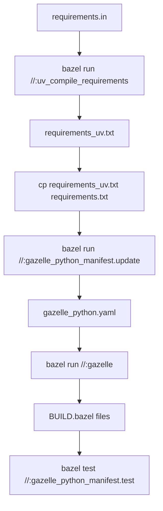
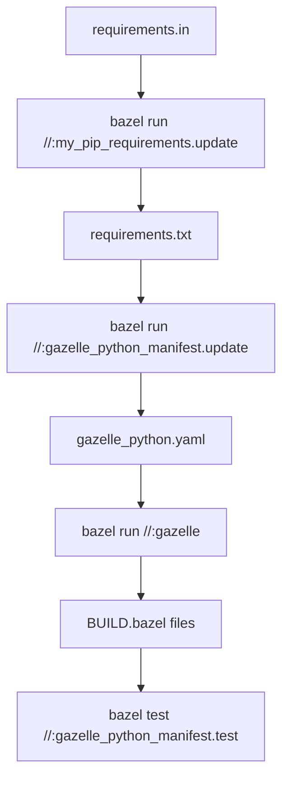

# Bazel Monorepo Demo

This project demonstrates a Bazel monorepo setup with cross-language services (Python and Kotlin) and automated dependency management using Gazelle.

## Services

### Python Service (FastAPI)
- **Port**: 8000
- **Framework**: FastAPI with uvicorn
- **Features**: Data analysis with pandas/numpy, cross-service communication

### Kotlin Service
- **Port**: 8080  
- **Framework**: Simple HTTP server with Jetty-like functionality
- **Features**: HTTP server, shared data models, cross-service communication

## Building and Running

### Build all services
```bash
bazel build //:all_services
```

### Build individual services
```bash
# Python service
bazel build //app/python:main

# Kotlin service  
bazel build //app/kotlin:kotlin_service

# Build individual modules
bazel build //app/kotlin/src/main/kotlin/com/demo/models:shared_models
bazel build //app/kotlin/src/main/kotlin/com/demo/service:kotlin_service
```

### Run services
```bash
# Python service (runs on port 8000)
bazel run //app/python:main

# Kotlin service (runs on port 8080)
bazel run //app/kotlin:kotlin_service
```

### Using convenience aliases
```bash
# Python service
bazel run //:python_service

# Kotlin service
bazel run //:kotlin_service
```

## API Endpoints

### Python Service (http://localhost:8000)
- `GET /` - Hello world
- `GET /health` - Health check
- `GET /items/{item_id}` - Get item by ID
- `GET /data/analysis` - Data analysis demo
- `GET /call-kotlin` - Call Kotlin service
- `GET /shared-models/user/{user_id}` - User data in shared format

### Kotlin Service (http://localhost:8080)
- `GET /` - Hello world
- `GET /health` - Health check  
- `GET /users/{id}` - Get user by ID
- `GET /products` - List products
- `GET /call-python` - Call Python service

## Cross-Language Communication

Both services can communicate with each other:
- Python service can call Kotlin endpoints via `/call-kotlin`
- Kotlin service can call Python endpoints via `/call-python`

## Shared Models

The Kotlin service defines shared data models in `app/kotlin/src/main/kotlin/com/demo/models/SharedModels.kt` that can be used across services for consistent data structures.

## Project Structure

The monorepo is organized with modular BUILD files:

```
bazel_demo/
├── MODULE.bazel              # Bazel module configuration
├── BUILD                     # Root build file with gazelle configuration
├── gazelle_python.yaml       # Auto-generated Python dependency mapping
├── requirements.in/txt       # Python dependencies
└── app/
    ├── python/
    │   ├── BUILD.bazel        # Auto-generated by gazelle
    │   └── main.py
    └── kotlin/
        ├── BUILD              # Main Kotlin build file (aliases)
        └── src/main/kotlin/com/demo/
            ├── models/
            │   ├── BUILD       # Shared models build file
            │   └── SharedModels.kt
            └── service/
                ├── BUILD       # Service build file
                └── KotlinService.kt
```

## Dependencies

### Python
- FastAPI
- uvicorn  
- pandas
- numpy
- requests

### Kotlin
- Gson (JSON serialization)
- OkHttp (HTTP client)

## Automated Dependency Management with Gazelle & UV

This project uses [Gazelle](https://github.com/bazelbuild/bazel-gazelle) with the Python plugin for automated BUILD file generation and [UV](https://github.com/astral-sh/uv) for ultra-fast Python dependency management.

### Adding New Python Dependencies

When you need to add new Python packages to your project, you can choose between two workflows:

#### Option A: Using UV (Recommended - Much Faster)

1. **Update requirements.in**: Add your new dependencies to `requirements.in`
   ```bash
   # Example: adding new packages
   echo "scikit-learn==1.3.0" >> requirements.in
   echo "matplotlib>=3.5.0" >> requirements.in
   ```

2. **Compile with UV**: Generate the locked requirements file using UV
   ```bash
   bazel run //:uv_compile_requirements
   ```

3. **Copy UV requirements**: Use the UV-generated requirements for the main pip setup
   ```bash
   cp requirements_uv.txt requirements.txt
   ```

4. **Update Python manifest**: Regenerate the Gazelle Python manifest
   ```bash
   bazel run //:gazelle_python_manifest.update
   ```

5. **Auto-generate BUILD files**: Update BUILD files with new dependencies
   ```bash
   bazel run //:gazelle
   ```

6. **Verify everything works**: Test that the manifest is current and build succeeds
   ```bash
   bazel test //:gazelle_python_manifest.test
   bazel build //:all_services
   ```

#### Option B: Using Traditional pip-tools

1. **Update requirements.in**: Add your new dependencies to `requirements.in`
   ```bash
   # Example: adding new packages
   echo "scikit-learn==1.3.0" >> requirements.in
   echo "matplotlib>=3.5.0" >> requirements.in
   ```

2. **Compile requirements.txt**: Generate the locked requirements file
   ```bash
   bazel run //:my_pip_requirements.update
   ```

3. **Update Python manifest**: Regenerate the Gazelle Python manifest
   ```bash
   bazel run //:gazelle_python_manifest.update
   ```

4. **Auto-generate BUILD files**: Update BUILD files with new dependencies
   ```bash
   bazel run //:gazelle
   ```

5. **Verify everything works**: Test that the manifest is current and build succeeds
   ```bash
   bazel test //:gazelle_python_manifest.test
   bazel build //:all_services
   ```

### Gazelle & UV Commands

```bash
# Complete workflow for dependency updates (UV - FAST)
bazel run //:uv_compile_requirements             # Compile requirements.in → requirements_uv.txt (UV)
cp requirements_uv.txt requirements.txt          # Copy UV output to main requirements
bazel run //:gazelle_python_manifest.update      # Update Python dependencies manifest
bazel run //:gazelle                             # Auto-generate/update BUILD files for Python
bazel test //:gazelle_python_manifest.test       # Test that the manifest is up to date

# Complete workflow for dependency updates (Traditional)
bazel run //:my_pip_requirements.update          # Compile requirements.in → requirements.txt (pip-tools)
bazel run //:gazelle_python_manifest.update      # Update Python dependencies manifest
bazel run //:gazelle                             # Auto-generate/update BUILD files for Python
bazel test //:gazelle_python_manifest.test       # Test that the manifest is up to date

# UV-specific commands
bazel run //:uv_compile_requirements             # Compile with UV (faster resolution)
bazel run //:create_venv                         # Create venv in ./venv/ directory
bazel run //:create_dev_venv                     # Create venv in ./.venv/ directory (hidden)
bazel run //:create_prod_venv                    # Create prod venv in ./prod_venv/ directory

# Individual commands
bazel run //:gazelle_python_manifest.update      # Update Python dependencies manifest only
bazel run //:gazelle                             # Auto-generate/update BUILD files only
bazel test //:gazelle_python_manifest.test       # Test manifest integrity only
```

### Automated UV Workflow

For convenience, use the provided automation script:

```bash
# Run the complete UV workflow with one command
./update_deps_uv.sh
```

This script automatically:
1. ⚡ Compiles dependencies with UV (super fast!)
2. 📋 Updates requirements.txt 
3. 🗺️ Regenerates Python manifest
4. 🏗️ Updates BUILD files
5. 🧪 Tests manifest integrity
6. 🔨 Verifies all services build

### How Gazelle Works

1. **Requirements Compilation**: `requirements.in` → `requirements.txt` (locked versions)
2. **Dependency Discovery**: Gazelle scans Python files for import statements
3. **Manifest Generation**: Creates `gazelle_python.yaml` mapping imports to pip packages
4. **BUILD File Generation**: Automatically generates `BUILD.bazel` files with proper dependencies
5. **Type Stub Integration**: Automatically includes type stub packages when `include_stub_packages = True`

### Dependency Management Workflow

**UV Workflow (Recommended - Fast):**


**Traditional Workflow:**


### Configuration Files

- **`requirements.in`**: Human-readable dependency specifications (manually edited)
- **`requirements.txt`**: Locked dependency versions (auto-generated)
- **`gazelle_python.yaml`**: Auto-generated mapping from Python imports to pip packages
- **`BUILD.bazel`**: Auto-generated BUILD files for Python packages (in app/python/)

### Gazelle Rules

- **`compile_pip_requirements`**: Compiles `requirements.in` → `requirements.txt`
- **`modules_mapping`**: Fetches metadata for Python packages from pip
- **`gazelle_python_manifest`**: Produces targets for updating and testing the manifest
- **`gazelle_binary`**: Custom gazelle binary with Python language support
- **`gazelle`**: Main rule for generating BUILD files

### UV Benefits

UV provides significant performance improvements over traditional pip-tools:

- **10-100x faster** dependency resolution
- **Rust-based** resolver for maximum performance
- **Compatible** with existing pip workflows
- **Better error messages** and conflict resolution

### Virtual Environment Configuration

You can create multiple virtual environments with different configurations:

| Target | Command | Directory | Purpose | Requirements File |
|--------|---------|-----------|---------|-------------------|
| `create_venv` | `bazel run //:create_venv` | `./venv/` | Default development | `requirements_uv.txt` |
| `create_dev_venv` | `bazel run //:create_dev_venv` | `./.venv/` | Hidden dev environment | `requirements_uv.txt` |
| `create_prod_venv` | `bazel run //:create_prod_venv` | `./prod_venv/` | Production-like | `requirements.txt` |

**Custom Virtual Environment Paths:**

You can customize the virtual environment path by modifying the `venv_directory` parameter in the BUILD file:

```python
create_venv(
    name = "my_custom_venv",
    requirements_txt = "//:requirements_uv.txt",
    venv_directory = "my_custom_path",  # Custom path
)
```

**Common Path Conventions:**
- `venv/` - Standard visible directory
- `.venv/` - Hidden directory (common in Python projects)  
- `env/` - Alternative naming
- `python_env/` - Descriptive naming
- `dev_env/`, `prod_env/` - Environment-specific naming

### Common Workflow Examples

**Adding a new data science package (UV - Fast):**
```bash
# 1. Add to requirements.in
echo "scikit-learn==1.3.0" >> requirements.in

# 2. Run the complete update workflow with UV
bazel run //:uv_compile_requirements
cp requirements_uv.txt requirements.txt
bazel run //:gazelle_python_manifest.update  
bazel run //:gazelle

# 3. Verify everything works
bazel test //:gazelle_python_manifest.test
bazel build //app/python:main
```

**Adding a web framework (UV - Fast):**
```bash
# 1. Add to requirements.in  
echo "flask==2.3.0" >> requirements.in
echo "flask-cors==4.0.0" >> requirements.in

# 2. Update dependencies and BUILD files with UV
bazel run //:uv_compile_requirements
cp requirements_uv.txt requirements.txt
bazel run //:gazelle_python_manifest.update
bazel run //:gazelle

# 3. Test and build
bazel test //:gazelle_python_manifest.test
bazel build //:all_services
```

**Creating development environments with UV:**
```bash
# Create a fast UV-based virtual environment for development
bazel run //:create_venv

# Activate the UV environment (default path: venv/)
source venv/bin/activate

# Alternative: Create development environment in .venv/ (hidden)
bazel run //:create_dev_venv
source .venv/bin/activate

# Alternative: Create production-like environment
bazel run //:create_prod_venv
source prod_venv/bin/activate
```

**Traditional workflow (if UV is not available):**
```bash
# 1. Add to requirements.in
echo "scikit-learn==1.3.0" >> requirements.in

# 2. Run the traditional workflow
bazel run //:my_pip_requirements.update
bazel run //:gazelle_python_manifest.update  
bazel run //:gazelle

# 3. Verify everything works
bazel test //:gazelle_python_manifest.test
bazel build //app/python:main
```

## Development

The monorepo structure allows for:
- **Shared build configuration** via Bazel
- **Cross-language dependency management** 
- **Automated BUILD file generation** with Gazelle
- **Consistent build and deployment processes**
- **Service-to-service communication patterns**
- **Modular architecture** with separate BUILD files for different components
